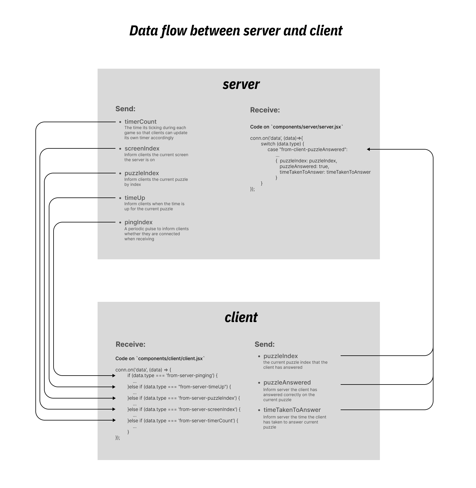
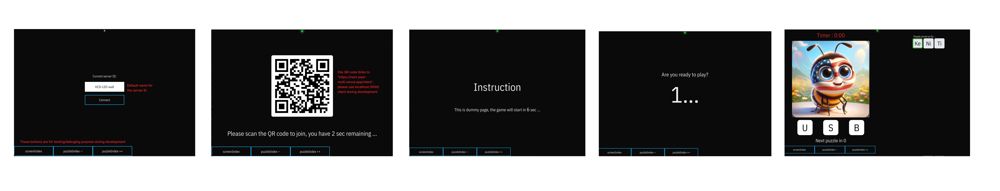
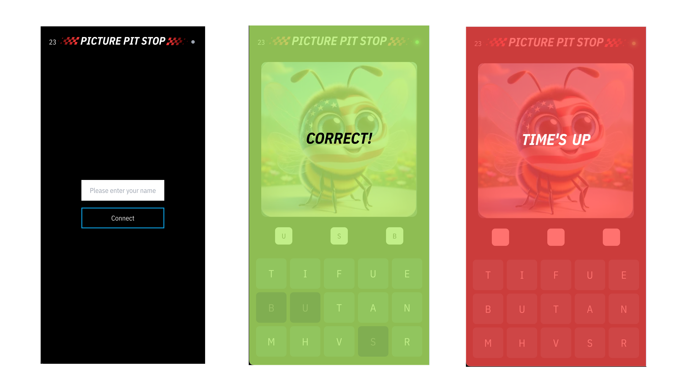

This is a social word puzzle game designed to be played collaboratively. Participants guess words represented by their corresponding images. The game utilizes a central stage screen displaying the images, and participants can join by scanning a QR code on the stage with their mobile devices. Players then input their answers using a mobile interface. The game's functionality is powered by PeerJS and NextJS.

## Getting Started

```bash
npm run dev
# or
yarn dev
# or
pnpm dev
# or
bun dev
```

Open [http://localhost:3000](http://localhost:3000) with your browser to see the result.

The game's communication is facilitated through two main pages:
1. `app/page.js`: This page represents the main stage and contains the majority of the game logic within the `src/components/server/server.jsx` component.
2. `app/client/page.jsx`: This page represents the client interface and houses its primary logic in the `src/components/client/client.jsx` component.

Communication between these pages is achieved via PeerJS, using signal types like "from-server-xxxxx" for server-initiated data and "from-client-xxxxx" for client-initiated data.

**The primary data flow is initiated by the server**, which informs clients about the following:
- "pingIndex": A periodic pulse (sent every second) that informs the clients that they are still connected. 
- "screenIndex": Indicates a change in the main stage screen.
- "puzzleIndex": Signals a change in the current puzzle.
- "timeUp" - the time is up for the current puzzle

Signals initiated by the client to the server include:
- "puzzleAnswered": Indicates that the client has correctly answered the current puzzle.
- "timeTakenToAnswer": Reports the time taken by the client to answer the puzzle.

In previous versions, a "remote control" client was implemented, but it has been removed for the current iteration. The potential need for a "remote control" client will be reevaluated as the project progresses.


**This image demonstrates the data flow between the server and the clients**




**Images from the server page**



**Images from the client page**



## Learn More

To learn more about Next.js, take a look at the following resources:

- [Next.js Documentation](https://nextjs.org/docs) - learn about Next.js features and API.
- [Learn Next.js](https://nextjs.org/learn) - an interactive Next.js tutorial.

You can check out [the Next.js GitHub repository](https://github.com/vercel/next.js/) - your feedback and contributions are welcome!

## Deploy on Vercel

The easiest way to deploy your Next.js app is to use the [Vercel Platform](https://vercel.com/new?utm_medium=default-template&filter=next.js&utm_source=create-next-app&utm_campaign=create-next-app-readme) from the creators of Next.js.

Check out our [Next.js deployment documentation](https://nextjs.org/docs/deployment) for more details.
